## Prova de RAID 5 a VirtualBox

A continuació, s'explica que es realitzarà una prova pràctica de configuració de RAID 5 utilitzant VirtualBox com a entorn de virtualització. L'objectiu és simular el funcionament d'un sistema RAID 5 per entendre millor els seus avantatges i limitacions. Per a això, es crearà una màquina virtual amb el sistema operatiu Windows 10, a la qual s'afegiran quatre discs durs virtuals. Aquests discs es faran servir per configurar el volum RAID 5 des del propi sistema operatiu, permetent observar el procés de creació, la gestió de la redundància i la tolerància a fallades. Aquesta pràctica ajudarà a comprendre com es distribueixen les dades i la paritat entre els discs, així com els passos necessaris per recuperar la informació en cas de fallada d'un dels discs.

Ara he afegit 4 discs al virtualbox.

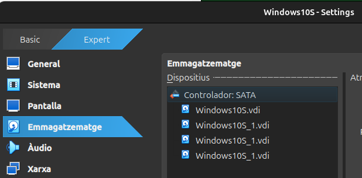

Un cop dins entroa la configuració de discos i podem veure que detacta els 3 discos virtuals afegits.

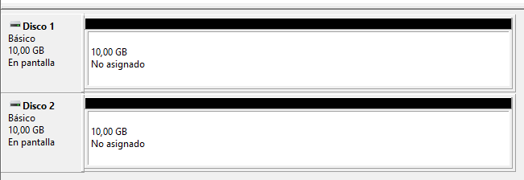
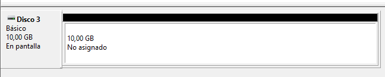

Ara cal convertir els discs virtuals a discs dinàmics per poder crear volums etc.

Ja surt l'opció de ferho en RAID 5.
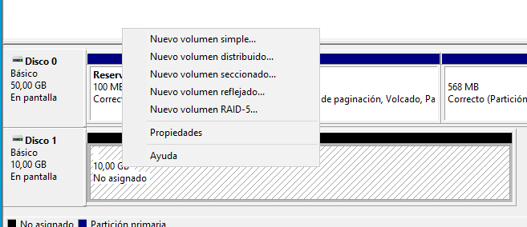

Ens obrira una pestanya de l'asistent.

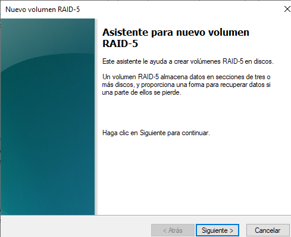

I seleccionarem els discs per crear el RAID 5.

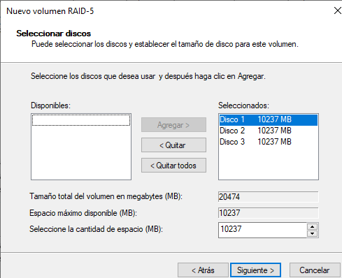

Assigno una lletra.

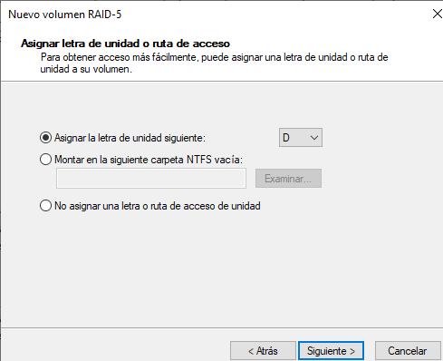

Formateigo el volum amb format NTFS predeterminat de Windows.

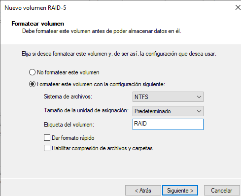

Surtira aquest avís.

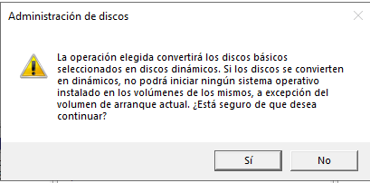

I ja els tenim formatats per al RAID5.

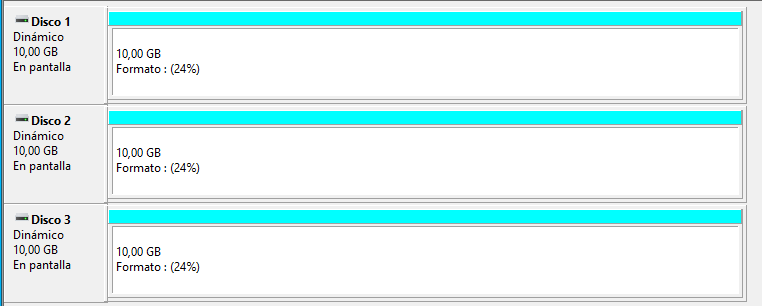

## Prova fallada

Ara realitzare una prova de fallada per comprovar la funcionalitat de RAID5 per mantenir les dades útils.

Pimer he creat una carpeta i un fitxer a la unitat del RAID5 en el meu cas la D:.

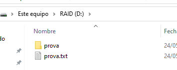

 **Simulo la fallada**
 
 Ara elimino un dels tres discs.
 Clicare a sense connexió  al disc 3.

 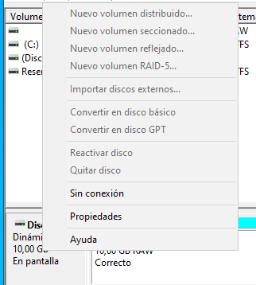

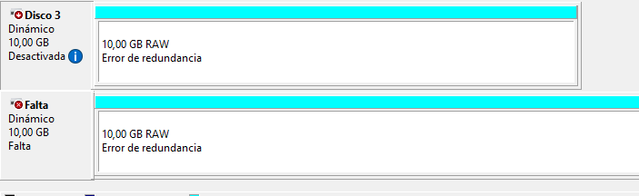

I puc comprovar que encara existeix la carpeta i l'arxiu.

## Conclusions

- RAID 5 ofereix una bona combinació de seguretat i eficiència.
- Protegeix les dades davant la fallada d’un disc sense perdre gaire capacitat ni rendiment.
- És útil en entorns on la disponibilitat i la integritat de la informació són importants.
- No requereix una gran inversió en discs addicionals.
- Tot i així, no substitueix la necessitat de fer còpies de seguretat.
