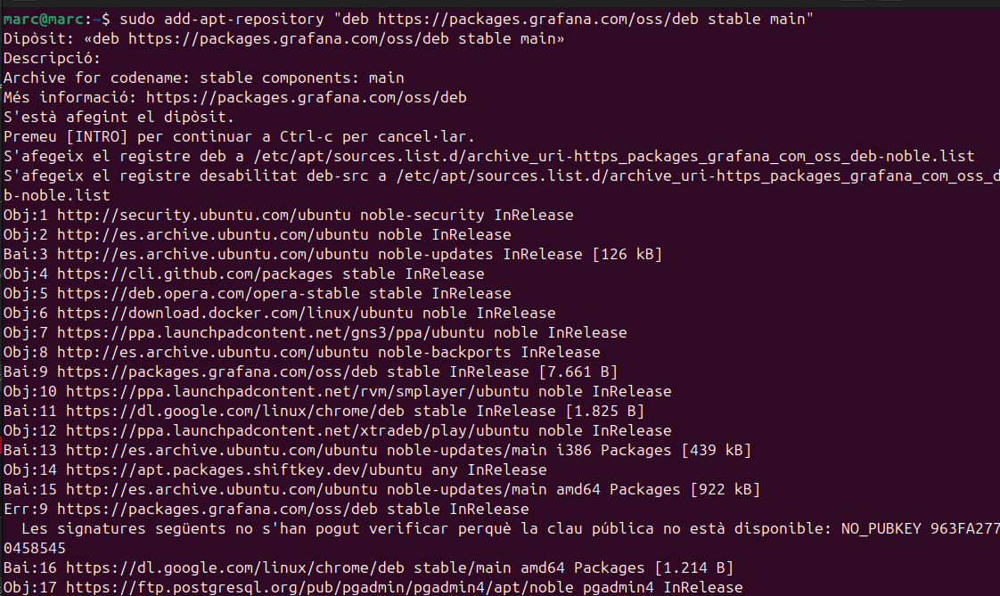

# Monitoratge i Relació amb els Logs

El monitoratge és una part essencial de la gestió de sistemes i aplicacions. Permet als administradors i desenvolupadors supervisar el rendiment, la disponibilitat i la salut general dels sistemes. A través del monitoratge, es poden detectar problemes abans que es converteixin en incidents greus.

## Importància del Monitoratge

El monitoratge proporciona informació en temps real sobre l'estat dels sistemes. Això inclou mètriques com l'ús de la CPU, la memòria, l'espai de disc, i altres recursos crítics. 

## Relació amb els Logs

Els logs són registres detallats de les activitats que es produeixen en un sistema o aplicació. Aquests registres són fonamentals per al monitoratge, ja que proporcionen un historial d'esdeveniments que es poden analitzar per identificar i resoldre problemes. Els logs poden incloure informació sobre errors, advertències, i altres esdeveniments significatius.

## Eina de Monitoratge d'Ubuntu

Ubuntu inclou una eina de monitoratge preinstal·lada que permet als usuaris supervisar el rendiment del sistema i detectar problemes potencials. Aquesta eina proporciona una interfície gràfica per visualitzar mètriques com l'ús de la CPU, la memòria, l'espai de disc, i altres recursos crítics.

### Característiques Principals

- **Supervisió en Temps Real**: Permet veure l'estat actual dels recursos del sistema.
- **Historial de Mètriques**: Guarda un registre de les mètriques per a l'anàlisi posterior.
- **Alertes i Notificacions**: Configura alertes per a esdeveniments específics, com l'ús elevat de la CPU o la memòria.

### Com Accedir a l'Eina

L'eina de monitoratge es pot trobar al menú d'aplicacions d'Ubuntu sota el nom "Monitor de Sistema". També es pot accedir a través de la línia de comandes amb l'ordre `gnome-system-monitor`.

Aquesta eina és essencial per mantenir el sistema en bon estat i assegurar-se que tots els recursos s'utilitzen de manera eficient.
## On podem trobar els logs del sistema? 

Els logs a qualsevol sistema Linux els trobem al directori /var/log.

 

Per exemple podem trobar els logs del servidor apache per exemple deins de la carpeta apache.

 

Dins podrem visualitzar els error que podem tindre al servidor al executar qualsevol comanda etc.

 

Podem programar i configurar els logs dins de /etc/logrotate.conf.

 

Per defecte és mantindrat els logs durant una semana tot i que ho podem canviar. 

Aquí ens indica on podem configurar els logs per les aplicacions o serveis que nosaltres volem.

 

 

Com exemple els logs del dpkg, per defecte podem veure que canvien cada 12 dies.

 

### Veure els logs 

Una eina molt útil per visualitzar els logs és el grep -i que podem filtrar per una paraula en concret per exemple error.

En aquest cas no ha trobat la paraula error dins del log.

 

També podem visualitzar les últimes línies de l'arxiu amb el tail.

 

Systemctl és un altra forma de visualitzar tipus d'errors etc.

 

### Diferents tipus de logs

- **Logs del Sistema**: Registres generats pel sistema operatiu que inclouen informació sobre l'ús de recursos, errors de sistema, i altres esdeveniments rellevants, com els nombrats anteriorment.

- **Logs d'Aplicació**: Registres generats per aplicacions específiques que proporcionen informació sobre el seu funcionament intern, errors, i altres esdeveniments.

- **Logs de Seguretat**: Registres que inclouen informació sobre esdeveniments de seguretat, com intents d'accés no autoritzat, canvis en la configuració de seguretat, etc.

## Eines de Monitoratge

Hi ha diverses eines disponibles per al monitoratge de sistemes i aplicacions, cadascuna amb les seves pròpies característiques i avantatges. Algunes de les eines més populars inclouen:

- **Nagios**: Una eina de monitoratge de codi obert que proporciona una visió completa de l'estat dels sistemes i serveis.
- **Prometheus**: Una eina de monitoratge i alerta dissenyada per a la recopilació de mètriques i l'anàlisi en temps real.
- **Grafana**: Una plataforma d'analítica i monitoratge que permet la visualització de dades de diverses fonts en temps real.

### Exemple eina de monitoratge

Jo instal·lare el Grafana per fer la prova de monitoratge.

Grafana utilitza el seu propi repositori que el tindre que instal·lar.

 

 

Finalment afegire la clau GPG del repositori.

 

I ara ja l'instal·lare.

 

Ara iniciare el servidor.

 

I amb la IP del servidor en el meu cas ho estic fent en local i :3000 podrem accedir al grafana.

Ens registrem i ja estic dins.

 

### Instal·lació Loki

Primer l'he descarregat.

 

Ara l'he descomprimit.

 

Ara l'he mogut al directori /usr/bin/loki.

 

Ara li he donat permisos.

 

I he creat el fitxer de configuració .yaml per la configuracio de Grafana amb el Loki.
Aquest yaml defineix l'almacenatge dels logs amb un periode de temps.

 

Crei el fitxer per loki.

 

Inicio el Loki.

 

## Conclusió

El monitoratge i els logs són components crítics per a la gestió efectiva de sistemes i aplicacions. Proporcionen la visibilitat necessària per mantenir els sistemes funcionant de manera òptima i per respondre ràpidament a qualsevol problema que pugui sorgir.
