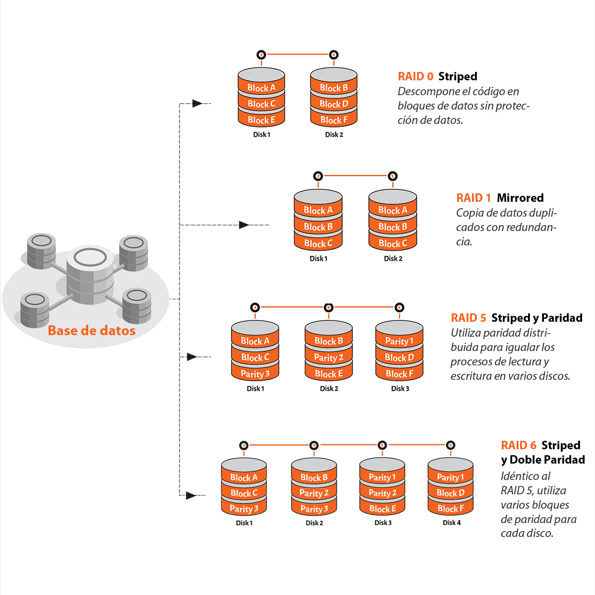

# RAID (Redundant Array of Independent Disks)

RAID és una tecnologia d'emmagatzematge de dades que combina múltiples discos durs en una sola unitat lògica per millorar el rendiment, la redundància o ambdues coses. Els diferents tipus de RAID ofereixen diverses combinacions de velocitat, capacitat i protecció de dades.

## Tipus de RAID

### RAID 0 
RAID 0 distribueix les dades uniformement entre dos o més discos sense cap redundància. Això millora el rendiment, ja que les dades es poden llegir i escriure simultàniament en múltiples discos. No obstant això, si un dels discos falla, es perden totes les dades.

### RAID 1 
RAID 1 duplica les dades en dos o més discos. Això proporciona una alta redundància, ja que si un disc falla, les dades es poden recuperar des del disc duplicat. El desavantatge és que la capacitat efectiva és la meitat de la capacitat total dels discos.

### RAID 5 
RAID 5 distribueix les dades i la informació de paritat entre tres o més discos. La paritat permet reconstruir les dades en cas de fallada d'un disc. Això ofereix un bon equilibri entre rendiment, capacitat i redundància. No obstant això, la reconstrucció de dades pot ser lenta.

### RAID 6 
RAID 6 és similar a RAID 5, però amb una segona capa de paritat. Això permet que el sistema pugui suportar la fallada de fins a dos discos simultàniament. Això proporciona una major protecció de dades a costa d'una mica més de capacitat d'emmagatzematge.

### RAID 10 
RAID 10 combina les tècniques de RAID 1 i RAID 0. Les dades es distribueixen i es dupliquen en un conjunt de discos. Això proporciona tant un alt rendiment com una alta redundància. No obstant això, requereix almenys quatre discos i la capacitat efectiva és la meitat de la capacitat total dels discos.

## Conclusió
RAID és una tecnologia versàtil que pot millorar el rendiment i la seguretat de les dades en funció de les necessitats específiques del sistema. La selecció del tipus de RAID adequat depèn dels requisits de capacitat, rendiment i redundància.

