# RAID 1

RAID 1 com ja he nombrat és una configuració de disc dur que duplica les dades en dos o més discos. Això proporciona redundància, ja que si un disc falla, les dades encara estan disponibles en l'altre disc. És ideal per a aplicacions on la seguretat de les dades és crítica.

Per poder fer una prova de  RAID 1 he afegit 2 discs més a la màquina virtual de 1GB per cada un.

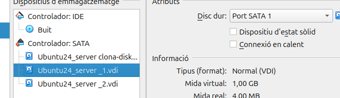

## Creació de particions

Quan creeu les particions, recordeu d'especificar l'opció "t" per definir el tipus de partició i "fd" per indicar que és de tipus Linux RAID autodetectable.

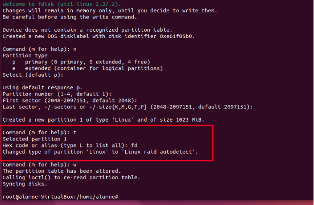

Ara instal·lare el mdadm, per configurar el RAID.

```
sudo apt install mdadm
```
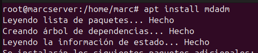


Ara creare el directori on instal·lare el raid.

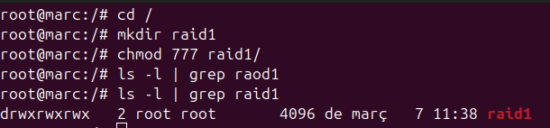

## Creació del Dispositiu RAID 1
Creació del RAID:
Utilitzeu mdadm per crear un dispositiu RAID 1 que agrupi les particions dels dos discs.

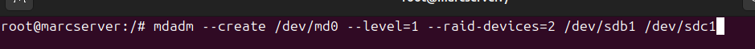


**Verificació de l'estat del RAID:**

Comprovem que el RAID s'està creant correctament. Podeu veure l'estat amb la comanda que mostra informació detallada.

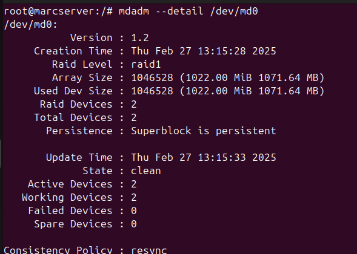

**Generació i actualització de la configuració de mdadm**

Executeu la comanda per escanejar la configuració actual del RAID i guardar-la al fitxer de configuració.

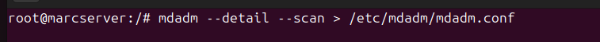

**Verificació i edició del fitxer de configuració**

Obriu el fitxer /etc/mdadm/mdadm.conf amb un editor (per exemple, "nano /etc/mdadm/mdadm.conf") per confirmar que la configuració s'ha desat correctament i, si cal, afegiu una nova línia o ajustos addicionals.

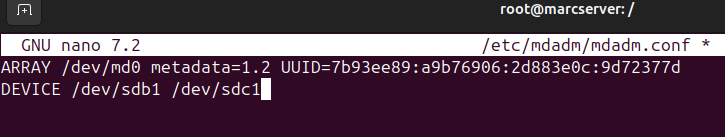

## Formatació i Muntatge del Dispositiu RAID. ##

Un cop creat i sincronitzat el dispositiu RAID (/dev/md0), formatgeu-lo amb el sistema d'arxius que preferiu (per exemple, ext4).

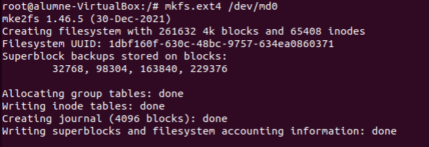

## Configuració de muntatge automàtic ##

Afegiu una entrada al fitxer /etc/fstab perquè el dispositiu RAID es munte automàticament en arrencar el sistema.

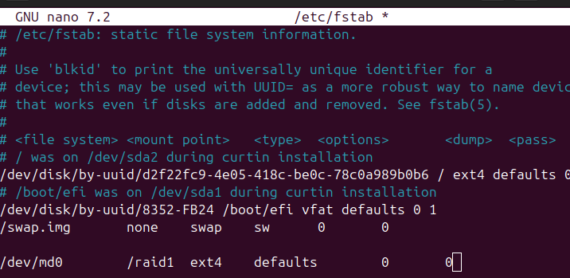

Muntatge i actualització del sistema
Executeu les ordres necessàries per muntar el dispositiu RAID, reiniciar el daemon corresponent i actualitzar la configuració d'arrencada del sistema amb una comanda com "update-initramfs -u -k all".

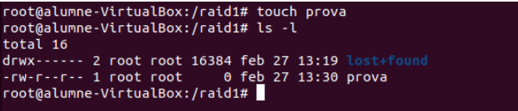

A continuació, desconnectem un disc del RAID amb la comanda mdadm /dev/md0 -f /dev/sdb1.

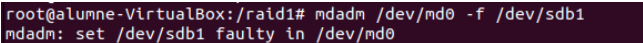

Verifiquem l'estat del RAID amb mdadm --detail /dev/md0. La sortida mostra que el disc /dev/sdb1 es troba en estat "faulty".

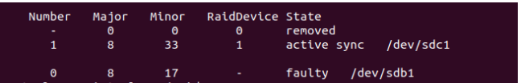

Procedim a treure el disc defectuós amb mdadm /dev/md0 --remove /dev/sdb1 i verifiquem la configuració amb la mateixa comanda.

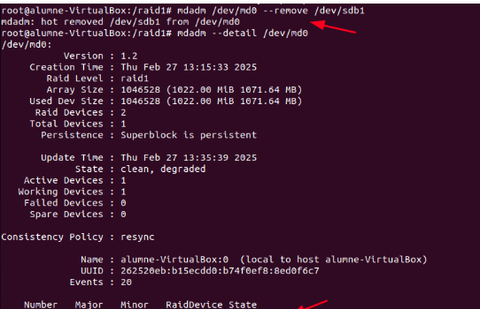

Per confirmar què ha passat amb les nostres dades, fem un ls al directori del RAID (per exemple, /raid1/). Comprovem que les dades no s'han esborrat, gràcies al RAID 1 que replica tot.

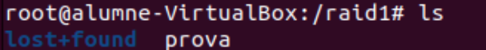

Finalment, reinserim el disc amb mdadm /dev/md0 -a /dev/sdb1 i podem observar que el sistema inicia el procés de "rebuiling". En uns instants, el disc tornarà a estar disponible per a l'ús.

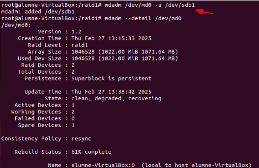
