# RAID 5

RAID 5 és una configuració de disc que utilitza striping amb paritat. Les dades es distribueixen entre tres o més discos, amb informació de paritat per permetre la recuperació en cas de fallada d'un disc. RAID 5 ofereix una bona combinació de rendiment, capacitat i tolerància a fallades.

El primer pas és assegurar-se que els quatre discos estiguin correctament connectats al sistema. Podeu verificar-ho visualment i amb eines de gestió del sistema.

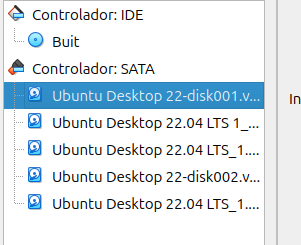

El primer pas és assegurar-se que els quatre discos estiguin correctament connectats al sistema. Podeu verificar-ho visualment i amb eines de gestió del sistema.

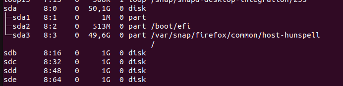

Ara he creat les particions per als 4 discos.

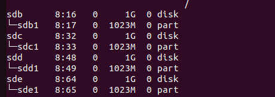

Aquesta instrucció agrupa les particions dels quatre discos en un únic dispositiu RAID, anomenat /dev/md0.

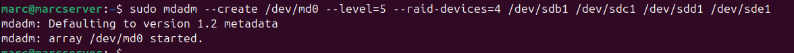

Podem fer un detail per comprovar que s''ha creat correctament.

Un cop fet això formateijo la partció on tinc els discos creada anteriorment.

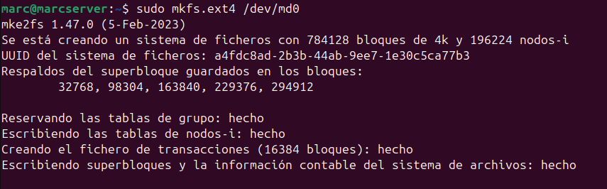

Ara creare una carpeta on muntare la partició temporalment.

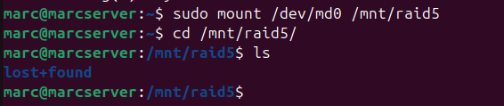

Per desar la configuració actual del RAID, escanegeu-la i deseu-la al fitxer de configuració executant:

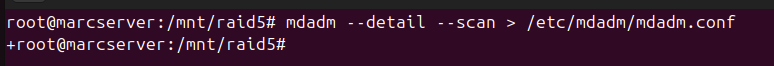

Obriu el fitxer /etc/mdadm/mdadm.conf amb l'editor de text que preferiu per confirmar que la configuració s'ha desat correctament. Si cal, realitzeu els ajustos addicionals corresponents.

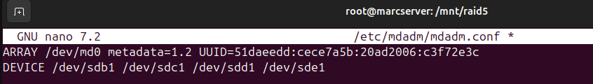

## Configuració del Muntatge Automàtic FSTAB ##

Per assegurar que el dispositiu RAID es munte automàticament en arrencar el sistema, afegiu la línia corresponent al fitxer /etc/fstab. D'aquesta manera, no caldrà muntar-lo manualment en cada reinici.

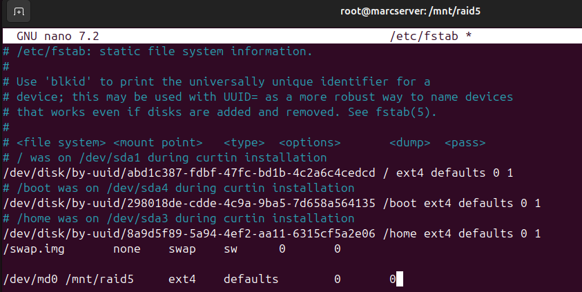

A continuació he creat un arxiu i una carpeta per fer la comprovació.

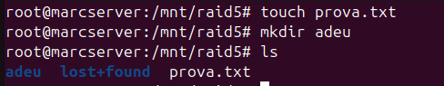

A continuació, es simula la fallada eliminant el disc número 3 del conjunt RAID.

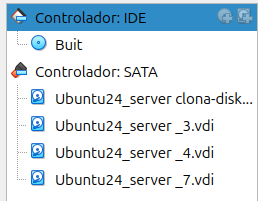

Ara cal executar aquestes comandes per poder activar el RAID al reiniciar la màquina.

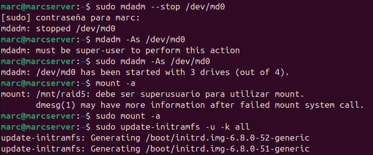

Finalment si entro a la carpeta podem comprovar que els arxius i carpetes creades continuen existint.

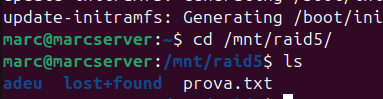
