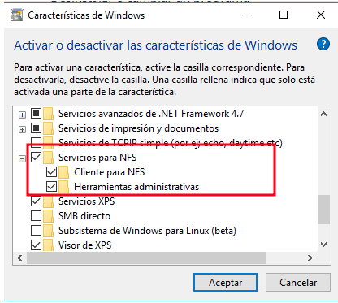

Pimer instl·lare el servidor nfs al Ubuntu, amb aquesta comanda.

També l'instl·lació per la part del Ubuntu client.

I per al client Windows.

Seguidament anire a activar o desactivar característiques de Windows.

I finalment activare el servei nfs per al client.

Ara creo una carpeta anomenada compartida i li dono els permisos adients.

Ara al arxiu exports afegeixo aquesta línia 

Si ara faig la prova amb el windows puc comprovar que efectivament esta compartida cal recordar que tene que estar al mateix rang de xarxa.

Sí ara creo una carpeta desde el Windows la tinc que poder visualitzar al servidor.

Efectivament apareix al servidor.

