# Introducció al servidor Samba
Un servidor Samba és una implementació lliure del protocol de xarxa SMB/CIFS, que permet la comunicació i l'intercanvi de fitxers entre ordinadors amb sistemes operatius diferents, com ara Linux, Windows i macOS. Samba facilita la integració de màquines Linux en entorns de xarxa Windows, permetent compartir recursos com ara fitxers i impressores de manera transparent i segura. A més, Samba pot actuar com a controlador de domini, gestionant autenticacions i permisos d'accés en una xarxa corporativa.

Primer instal·lo el servidor SAMBA.

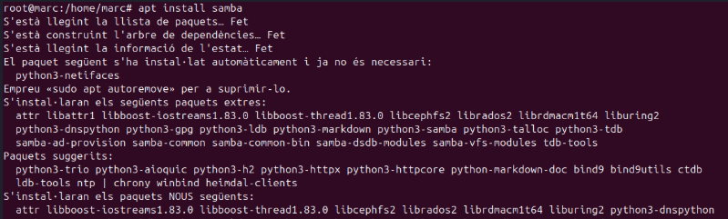

Ara creare la carpeta on també li donare permisos.

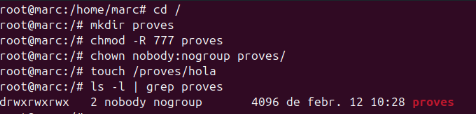

Ara dins del fitxer smb.conf un cop instl·lat samba posarem els permisos que li volem donar a la carpeta

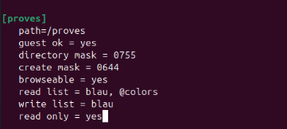

Per aplicar els canvis realitzats he fet un systemctl restart smbd nmbd per reiniciar el servidor.

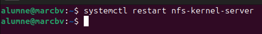

Ara he creat els usuaris al servidor, amb el useradd.

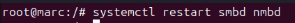

Ara he creat més usuaris per fer proves.
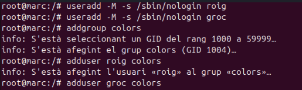

Ara faig un tail per veure els usuaris que he creat.

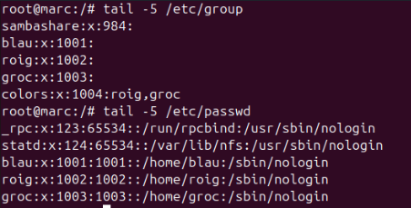

Ara assigno una contrasenya al usuaris dins del servidor samba d'aquesta manera.

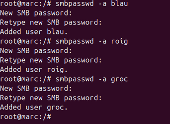

Per últim canviarem algúns permisos com ara que l'usuari roig no pugui entrar, que els usuaris del grup colors puguin llegir i que balu pot llegir i escriure. També podrem iniciar sessió com a convidat.

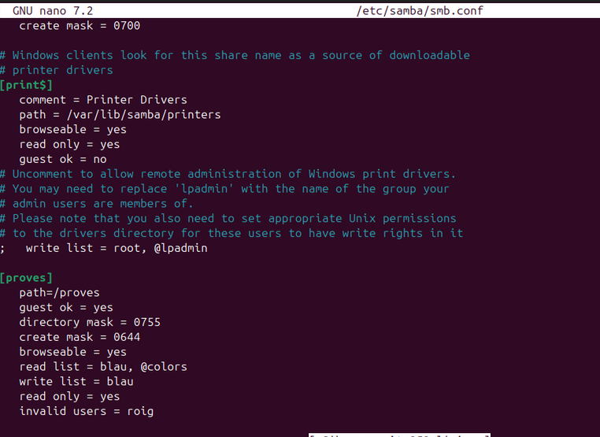

## Proves amb client

Per configurar la part del client, repetirem els passos anteriors, fer un update i després instal·lar el paquet de samba.

Un cop instal·lat el samba client obrire l'explorador d'arxius i posare la IP del servidor juntament amb la carpeta compartida.

Ara ens demanara com ens vole autenticar com anonim o com un usuari registrat.

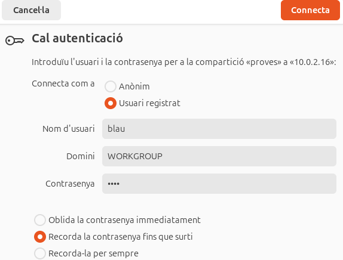

Ens registrem amb l'usuari blau que té permisos sobre la carpeta i efectivament la podem veure.

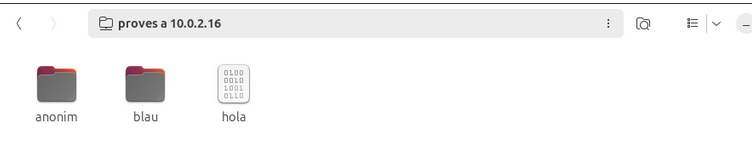

Comprovació de permísos creats.

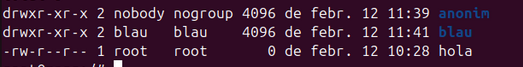

Si intento entrar amb els usuaris que no tenen permís sobre la carpeta com son groc i roig no ens deixa.

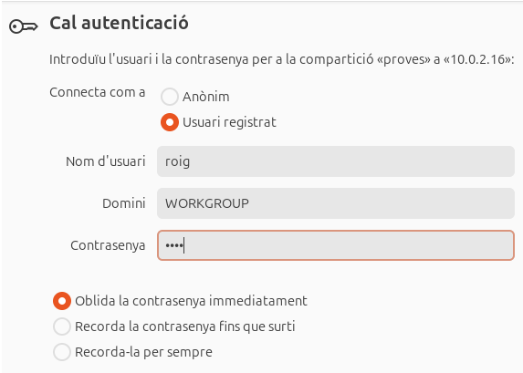

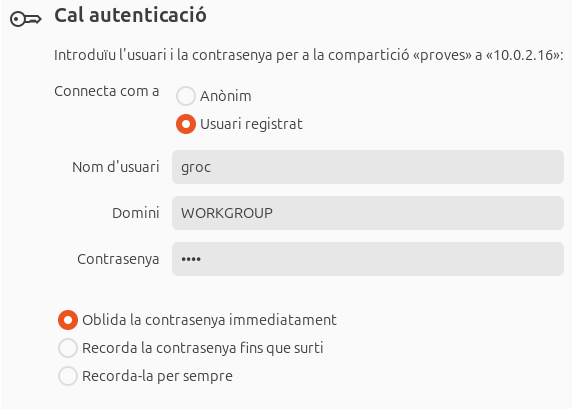

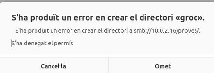
