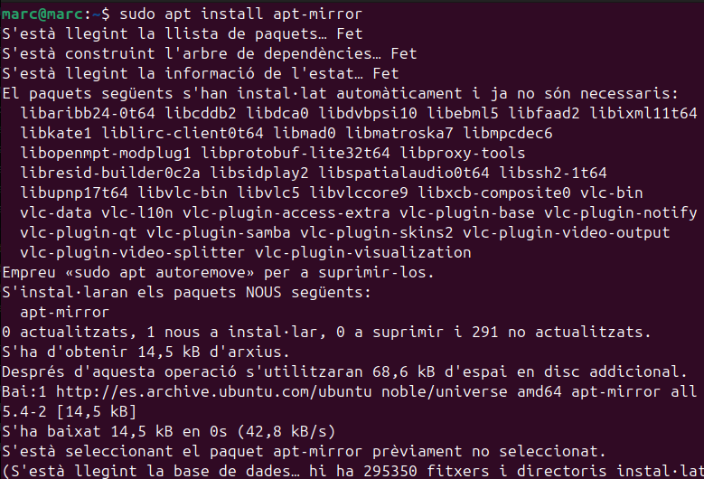
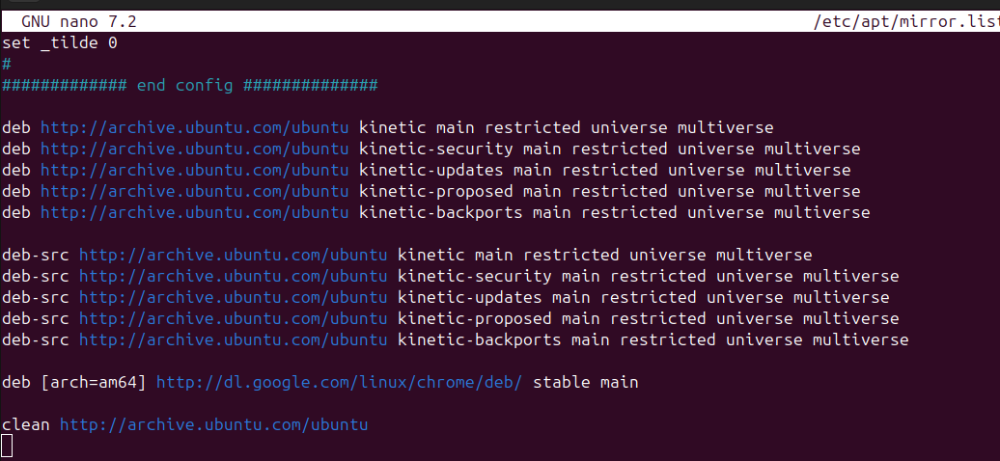
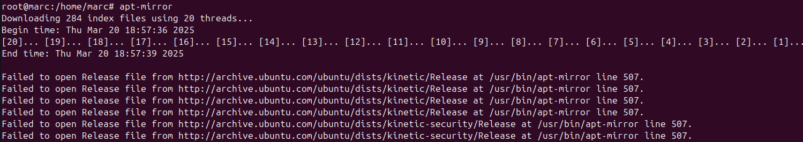
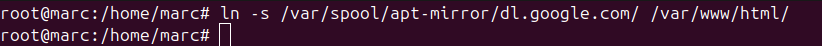
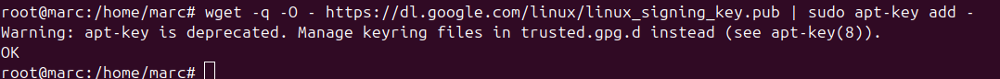
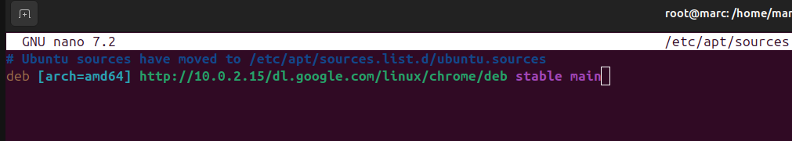
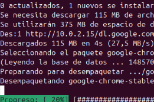

# Servidor d'actualitzacions

Un **servidor d'actualitzacions** és un sistema que gestiona i distribueix actualitzacions de programari a altres dispositius o aplicacions dins d'una xarxa. Aquest tipus de servidor és especialment útil en entorns empresarials on hi ha molts dispositius que necessiten mantenir-se actualitzats de manera consistent i segura.

## Funcions principals

- **Centralització de les actualitzacions**: Totes les actualitzacions es gestionen des d'un únic punt, facilitant el control i la supervisió.
- **Distribució eficient**: Les actualitzacions es poden distribuir de manera programada i escalonada per evitar saturar la xarxa.
- **Seguretat**: Permet assegurar-se que totes les màquines reben les actualitzacions de seguretat necessàries per protegir-se contra vulnerabilitats.
- **Compatibilitat**: Assegura que totes les màquines tinguin versions compatibles del programari, evitant problemes de compatibilitat.

## Avantatges

- **Reducció de l'ample de banda**: En lloc de cada dispositiu descarregar les actualitzacions directament d'internet, les descarreguen del servidor local, reduint l'ús de l'ample de banda.
- **Control administratiu**: Els administradors poden decidir quines actualitzacions s'instal·len i quan, permetent proves prèvies abans de la distribució general.
- **Historial d'actualitzacions**: Manté un registre de totes les actualitzacions aplicades, facilitant la gestió i el diagnòstic de problemes.
- **Eficiència**: Les actualitzacions es poden programar per a moments de baixa activitat, minimitzant l'impacte en la productivitat.

## Inconvenients

- **Cost inicial**: La implementació d'un servidor d'actualitzacions pot requerir una inversió inicial significativa en maquinari i programari.
- **Manteniment**: Requereix manteniment continu per assegurar-se que el servidor i les actualitzacions estan al dia.
- **Complexitat**: Pot afegir complexitat a la infraestructura de TI, especialment en entorns grans o heterogenis.
- **Dependència**: Si el servidor d'actualitzacions falla, els dispositius poden quedar sense les actualitzacions necessàries fins que es resolgui el problema.

## Exemples de servidors d'actualitzacions

- **Windows Server Update Services (WSUS)**: Utilitzat per gestionar actualitzacions en entorns Windows.
- **Red Hat Satellite**: Utilitzat per gestionar actualitzacions en sistemes Red Hat Enterprise Linux.
- **Apple Software Update Server**: Utilitzat per gestionar actualitzacions en dispositius Apple.

Un servidor d'actualitzacions és essencial per mantenir un entorn de TI segur, eficient i ben gestionat.

## Configuració Apache

 

Ara instal·lo el apt-mirror per als clients.

 

Comento les linies on posa deb-src i afegeixo la linia deb [arch=amd64]

 

Ara executo el mirror per baixar els deb que em comentat a l'arxiu mirror.

 

Enllaç.
 

## Configurar Clients

Afegeixo la clau pública de google.

 

 

Finalment faig la comprovacio fent un update 

 

