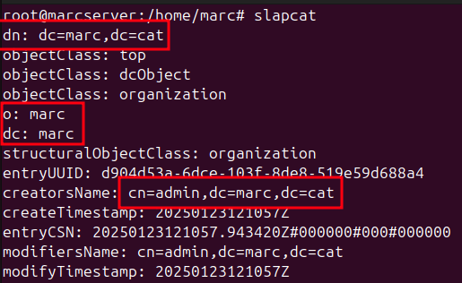
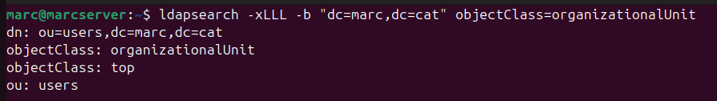

En aquest Sprint 3 configurarem un servidor LDAP utilitzant Ubuntu. Primer instal·larem i configurarem el servidor LDAP (OpenLDAP), establint el domini i els esquemes necessaris. Després, afegirem usuaris i grups al directori. Finalment, connectarem clients Ubuntu al servidor LDAP perquè puguin autenticar-se utilitzant les credencials centralitzades del directori.

Els passos principals seran:
 
1. Instal·lació i configuració d'OpenLDAP al servidor.
2. Creació d'usuaris i grups LDAP.
3. Configuració dels clients Ubuntu per unir-los al servidor LDAP.
4. Proves d'autenticació per verificar la connexió.

Això permetrà una gestió centralitzada dels usuaris i facilitarà l'administració de la xarxa.

El més optim per un servidor és tenir una xarxa asignada manualment ja que d'aquesta manera la IP del servidor no canviara i els clients és connectaran de forma optima cap a la mateixa IP.

Per tant li he assignat una ip manualment.


Per tant començare configurant slapd.


Ens demanara uns contrasenya d'administrador.


Ara ens preguntara si volem ometre la configuració li donare a no.


Li poso un nom de domini.


Puc comprovar que s'ha establert el nom del domíni amb la comanda slapcat.

Ens donara tota l'informació del domini.



Un cop fet això he configurat una nova unitat organitzativa, per això he creat un arxiu ldif anomenat uo on configurarem els paràmetres de la uo.



També he configurat un nou grup per al domini anomenat alumnes.


I també he configurat un usuari per al servidor.


Un cop crets els fitxers amb les configuracions els executo amb la comanda ldapadd -C -x -D domini fitxer creat.


Si torno a fer el slapcat podrem veure els canvis.


## Unir equips al client

En aquest apartat he fet la prova d'unir un equip al domini creat anteriorment.

Per tant he creat una nova màquina UbuntuClient.


Al terminal posare aquesta comanda per instal·lar aquest paquet.


Seguidament sen's mostra una finestra on tindrem que inserir la IP del nostre servidor ldap.


Ara li donem a continuar i sen's obri un altra pesatanya on posarem el domini del servidor configurat.


Finelament afegirem les tres línies de ldap compat a l'arxiu nsswitch per posar com predeterminat el server.


A continuació aplico una regla on el propi servidor quan s'uneix un client aquest li crea un directori automàticament, també li indico els permisos.


Ara permeto l'acces manual amb qualsevol usuari del domini.


Amb el search desde el client puc comprovar que esta connectat al servidor.
ldapsearch -x -H ldap://192.168.20.1 -b "dc=marcbv,dc=cat"


També puc buscar amb el search l'usuari creat anteriorment al servidor alu1.


I amb el getent dins del client.


## Com funciona la comanda `ldapadd`

La comanda `ldapadd` s'utilitza per afegir entrades al directori LDAP a partir d'un fitxer LDIF (LDAP Data Interchange Format). Aquesta eina permet importar usuaris, grups o qualsevol altra configuració definida en format LDIF al servidor LDAP.

**Sintaxi bàsica:**
```bash
ldapadd -x -D "cn=admin,dc=domini,dc=cat" -W -f fitxer.ldif
```

- `-x`: Utilitza autenticació simple (no SASL).
- `-D`: DN (Distinguished Name) de l'usuari administrador amb permisos per afegir entrades.
- `-W`: Demana la contrasenya de l'usuari especificat amb `-D`.
- `-f`: Especifica el fitxer LDIF que conté les dades a afegir.

**Exemple d'ús:**


Aquesta comanda afegirà les entrades definides a `uo.ldif` al directori LDAP, demanant la contrasenya de l'administrador.

Aquesta eina és essencial per gestionar i automatitzar la creació d'usuaris, grups i altres objectes dins del directori LDAP.

## Com funciona la comanda `ldapsearch`

La comanda `ldapsearch` s'utilitza per cercar i visualitzar informació emmagatzemada al directori LDAP. Permet realitzar consultes sobre usuaris, grups o qualsevol altra entrada del directori, mostrant-ne els atributs i valors.

**Sintaxi bàsica:**
```bash
ldapsearch -x -H ldap://servidor -b "base_dn" "filtre"
```

- `-x`: Utilitza autenticació simple.
- `-H`: Especifica l'URL del servidor LDAP.
- `-b`: Defineix el punt de partida (base DN) per a la cerca.
- `"filtre"`: Filtre LDAP per especificar quines entrades buscar (opcional).

**Exemple d'ús:**


Aquesta comanda buscarà l'usuari amb `uid=alu1` dins del directori LDAP i mostrarà tota la informació relacionada.

`ldapsearch` és molt útil per verificar que les entrades s'han creat correctament i per consultar qualsevol dada del directori LDAP.

## Com funciona la comanda `ldapmodify`

La comanda `ldapmodify` s'utilitza per modificar, actualitzar o eliminar entrades existents al directori LDAP a partir d'un fitxer LDIF que defineix els canvis. Aquesta eina permet fer canvis puntuals sense haver de recrear tota l'entrada.

**Sintaxi bàsica:**
```bash
ldapmodify -x -D "cn=admin,dc=domini,dc=cat" -W -f fitxer.ldif
```

- `-x`: Utilitza autenticació simple.
- `-D`: DN de l'usuari administrador amb permisos per modificar entrades.
- `-W`: Demana la contrasenya de l'usuari especificat amb `-D`.
- `-f`: Especifica el fitxer LDIF amb les modificacions.

**Exemple d'ús:**


Aquesta comanda aplicara els canvis del fitxer alu1.ldif

El fitxer LDIF pot contenir operacions com `add`, `replace` o `delete` sobre atributs d'una entrada. Això permet actualitzar informació d'usuaris, grups o qualsevol objecte del directori de manera eficient.


# Servidor NFS

Un servidor NFS (Network File System) és un servei que permet compartir directoris i fitxers a través de la xarxa entre diferents equips, principalment sistemes Unix i Linux. Amb NFS, un servidor pot exportar (compartir) carpetes perquè altres ordinadors (clients) puguin muntar-les i accedir-hi com si fossin part del seu propi sistema de fitxers local. Això facilita la gestió centralitzada de dades i la col·laboració entre usuaris de diferents màquines.

A Ubuntu, configurar un servidor NFS implica instal·lar el paquet `nfs-kernel-server`, definir quines carpetes es volen compartir (exportar) i establir els permisos d'accés per als clients. Els clients, per la seva banda, poden muntar aquestes carpetes compartides utilitzant el paquet `nfs-common` i accedir-hi de manera transparent.

NFS és molt utilitzat en entorns d'empresa, laboratoris i xarxes domèstiques per compartir recursos de manera eficient i segura.

## Exemple 

Primer he creat la carpeta que vull compartir i li he donat els permisos.


Ara instal·lo el paquet nfs-kernel.


I afegeixo aquesta línia per administrar els permisos compartits de la carpeta al fitxer exports.


I reinicio el servidor NFS.


Com estic utilitzant un client Windows Enterprise és necessari activar la característica de Client NFS.


I si posem la direcció del servidor ja tindra accés a la carpeta compartida.

