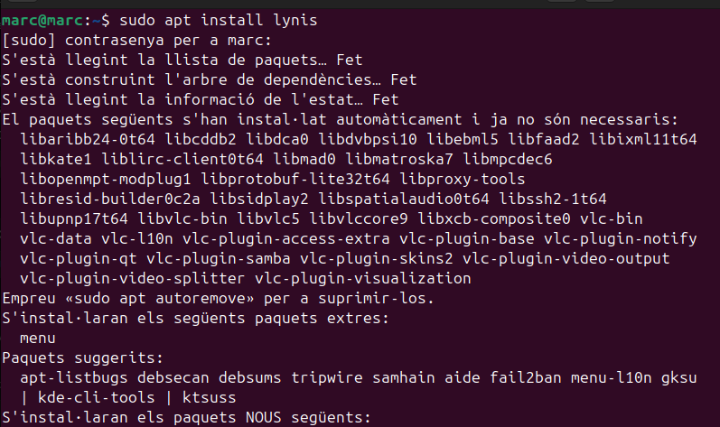
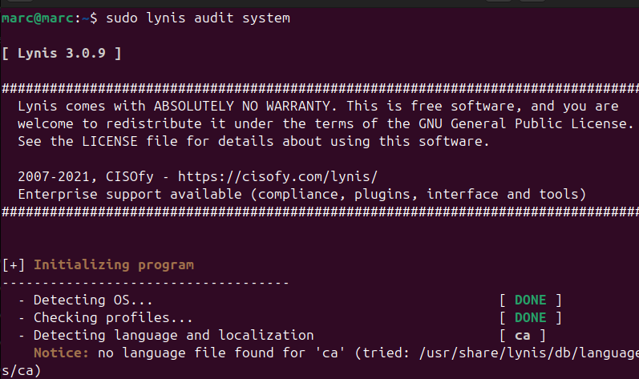
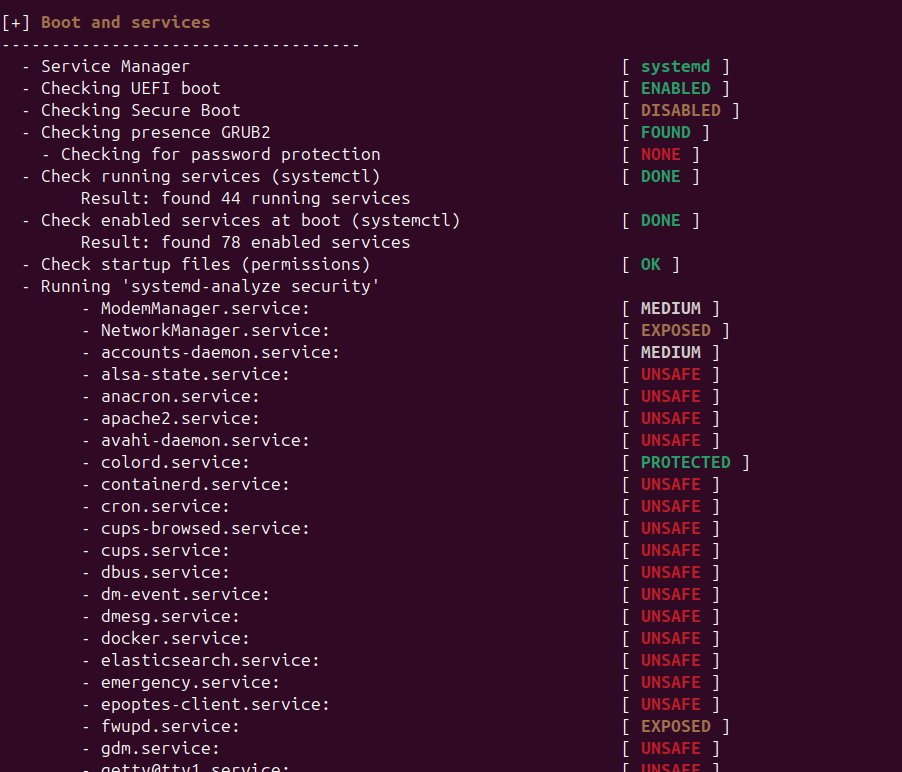
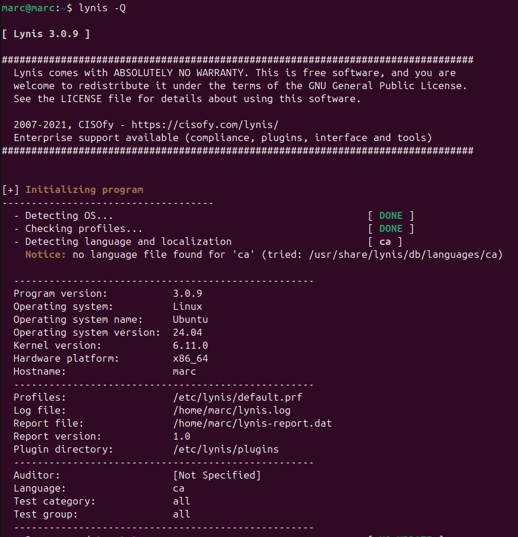
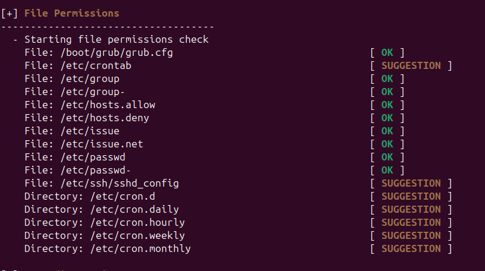
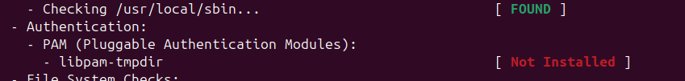
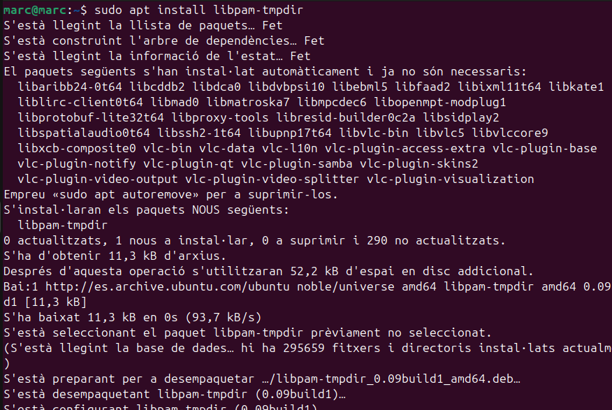
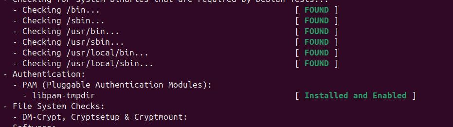

Una auditoria de seguretat a Linux és un procés sistemàtic per avaluar la seguretat d'un sistema Linux. Aquest procés implica la revisió i anàlisi de la configuració del sistema, els permisos de fitxers, els serveis en execució, les actualitzacions de seguretat aplicades, i altres aspectes rellevants per identificar vulnerabilitats i riscos potencials. L'objectiu és assegurar que el sistema compleixi amb les millors pràctiques de seguretat i les polítiques de seguretat establertes, així com detectar i corregir possibles problemes abans que puguin ser explotats per actors maliciosos.

### Lynis

Lynis és una eina de codi obert per a auditories de seguretat en sistemes Unix, incloent Linux. Aquesta eina és utilitzada per administradors de sistemes i auditors de seguretat per avaluar la seguretat dels seus sistemes. Lynis realitza una sèrie de proves per identificar vulnerabilitats, configuracions incorrectes i altres problemes de seguretat. Les seves funcionalitats inclouen:

- Revisió de configuracions del sistema
- Verificació de permisos de fitxers
- Anàlisi de serveis en execució
- Comprovació d'actualitzacions de seguretat
- Generació d'informes detallats amb recomanacions

Lynis és una eina valuosa per mantenir la seguretat i la integritat dels sistemes Unix, ajudant a detectar i corregir problemes abans que puguin ser explotats.

### Instal·lació Lynis

Primer l'instal·lo.

 

Ara inició l'auditoria.

 

Aquí podem comprovar els dispositius que detecta.

 

Amb la comanda lynis -Q puc fer un escaneig ràpid.

 

Si ens fixem hi han moduls no instal·lats i amb l'escaneig ens ho indica.

 

També ens indica algunes sugerencies.

 

Per exemple ara instal·lare el libpam que Lynis el detecta com no instal·lat.

 

Ara l'instal·lo.

 

Ara si tornem a fer l'escaneig podem comprovar que posa instal·lat i activat,

 

