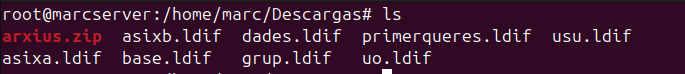
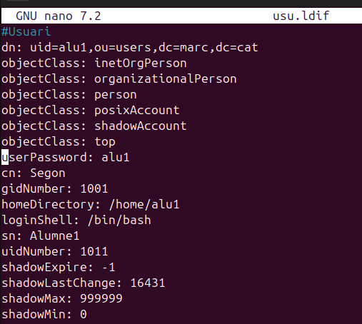
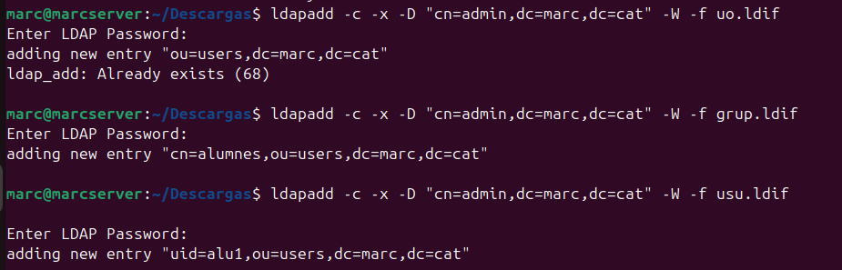
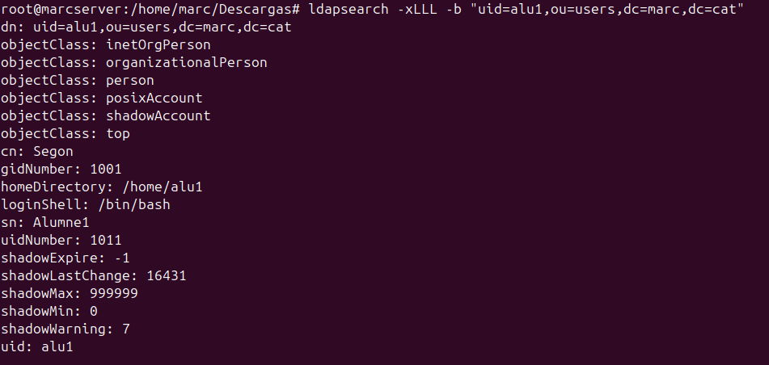
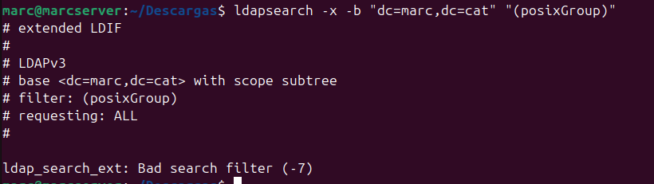
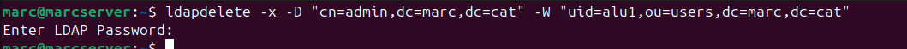
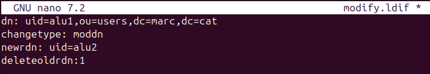
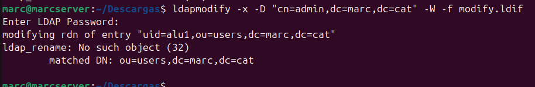
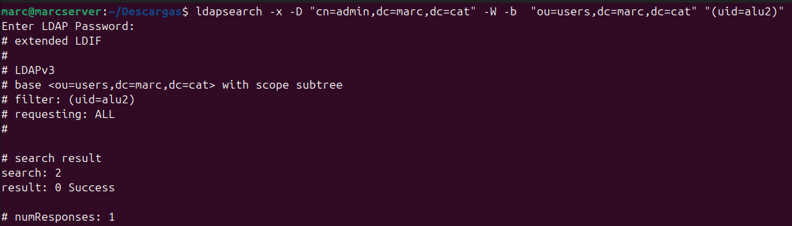

En aquest apartat explicare com podem gestionar un domini.

Amb la comanda slapcat podem comprovar que tinc el servidor.

Com puc comprovar tinc tres arxius el de usu.ldif per configurar usuaris al servidor, el ou per configurar unitats organitzatives i el grup per configurar grups.

## LDAPADD

Per fer proves he afegit un nou usuari dins del fitxer usu.ldif i amb el slapadd l'he afegit, també un grup i una unitat organitzativa.

## LDAPSEARCH

El comandament ldapsearch és una eina molt útil per consultar informació dins d’un domini LDAP. Amb aquesta eina podem buscar entrades, comprovar atributs, filtrar resultats i molt més. A continuació, veurem algunes de les seves funcionalitats bàsiques.

Com puc comprovar si busco l'usuari que tinc creat alu1 el troba.

Amb ldapsearch també podem veure les unitats organitzatives que tenim al servidor.

De la mateixa manera podem veure en aquest cas el grup que tinc afegit al servidor posixGroup.

## LDAPDELETE

La comanda ldapdelete ens permet esborrar contingut tant grups usuaris o unitats organitzatives al servidor ldap.

## LDAPMODIFY

Aquest parametre ens permet modificar camps dels objectes del servidor.

Tot i que aquest pas és més complex ja que primer tindrem que crear un nou arxiu .ldif on posarem els canvis que volem realitzar.

Comanda principal:

ldapmodify -x -D "cn=admin,dc=ejemplo,dc=com" -W

Ara creare l'arxiu, canvio el uid a alu2.

Finalment executo el modify, on al final posare l'arxiu ldif que he creat per realitzar els canvis.

Finalment he comprovat que efectivament ha canviat el uid de l'usuari a alu2.

