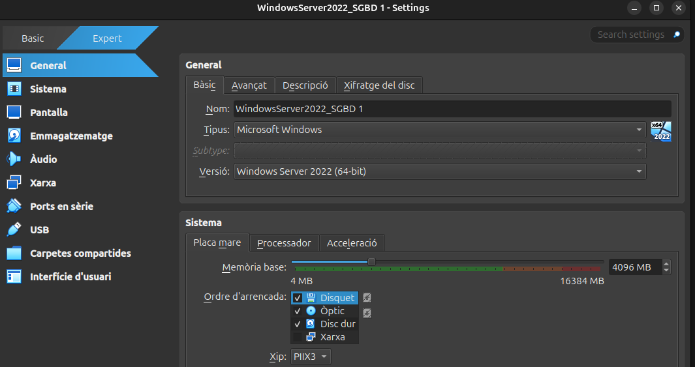
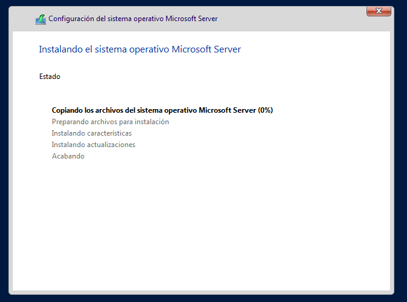

## Introducció

Windows Server és un sistema operatiu dissenyat per a servidors que ofereix funcionalitats avançades per a la gestió de xarxes, emmagatzematge i aplicacions. Aquesta guia està enfocada a una instal·lació de prova.

# Instal·lació Windows Server

La màquina estara configurada d'aquesta manera.

WindowsServer2022_SGBD 1 com a nom de la màquina, tipus Microsoft Windows, i la versió Windows Server 2022

De memoria li he assignat 4096

 
I d'interfície he escollit Xarxa NAT ja que ens permet tenir connexió a Internet desde la IP de la nostra màquina i la del host.

A continuacio començare a instal·lar el Windows Server.

A continuacio he seleccionat que el vull instl·lar amb un entorn gràfic.

I l'instalare al disc de la màquina virtual.

I començara l'instal·lació.

Li assignem la contrasenya de la màquina.

Ara ja tinc la màquina instal·lada, i un cop dins se'ns obri l'administrador del servidor 

És important configurar una IP estàtica al servidor ja que d'aquesta manera el servidor cada cop que es reinici no canviara la IP per tant els clients es mantindran connectats apartir de la mateixa IP.

Jo li assignare la mateixa IP que ens assigna la Xarxa Nat per primer cop.

Primer em dirigixo a l'apartat de xarxa i configurar l'adaptador de xarxa.

 
Click dret i propietats.

Hi ha configuració d'adreça ipv4.

I finalment li poso la IP manualment. 

# Instal·lació Windows 10 Desktop

Windows 10 Desktop és un sistema dissenyat principalment per a ordinadors personals, portàtils i dispositius tàctils. Ofereix una interfície gràfica d'usuari intuïtiva, suport per a aplicacions modernes i compatibilitat amb programes tradicionals. 

Aquesta és la configuració de la màquina per instal·lar Windows 10,

He aumentat la quantitat de processadors per aumentar la velocitat de la màquina.

I l'adaptador de xarxa.

# Llicencia Windows

## Tipus de Llicències de Windows

Microsoft ofereix diversos tipus de llicències per als seus sistemes operatius Windows, adaptades a diferents necessitats i entorns. A continuació es detallen els principals tipus de llicències:

### 1. **Llicència Retail (FPP - Full Packaged Product)**

- **Descripció**: Aquesta llicència està dissenyada per a usuaris finals que compren Windows com a producte independent.
- **Característiques**:
    - Es pot transferir d'un dispositiu a un altre, sempre que es desinstal·li del dispositiu anterior.
    - Inclou suport tècnic directe de Microsoft.
    - Ideal per a usuaris individuals o petites empreses.
- **Exemple d'ús**: Comprar una còpia de Windows 10 o 11 en una botiga física o en línia.

### 2. **Llicència OEM (Original Equipment Manufacturer)**

- **Descripció**: Aquesta llicència ve preinstal·lada en dispositius nous, com ordinadors portàtils o de sobretaula.
- **Característiques**:
    - Està vinculada al maquinari del dispositiu i no es pot transferir a un altre dispositiu.
    - No inclou suport tècnic directe de Microsoft; el suport és proporcionat pel fabricant del dispositiu.
    - Sol ser més econòmica que la llicència Retail.
- **Exemple d'ús**: Un ordinador nou amb Windows preinstal·lat.

### 3. **Llicència Volume (VL - Volume Licensing)**

- **Descripció**: Dissenyada per a organitzacions que necessiten instal·lar Windows en múltiples dispositius.
- **Característiques**:
    - Permet activar diverses còpies de Windows amb una única clau de llicència.
    - Inclou opcions de personalització i gestió centralitzada.
    - Ideal per a empreses, institucions educatives i governs.
- **Tipus comuns de llicències VL**:
    - **Open License**: Per a petites i mitjanes empreses.
    - **Enterprise Agreement**: Per a grans empreses amb necessitats avançades.
    - **Education License**: Per a institucions educatives.
- **Exemple d'ús**: Una empresa que instal·la Windows en 50 ordinadors.

### 4. **Llicència de Subscripció (Microsoft 365)**

- **Descripció**: Forma part de la subscripció a Microsoft 365, que inclou Windows com a servei.
- **Característiques**:
    - Ofereix accés a actualitzacions contínues i noves funcionalitats.
    - Inclou altres serveis com Office 365 i OneDrive.
    - Ideal per a usuaris que prefereixen un model de pagament per subscripció.
- **Exemple d'ús**: Subscriure's a Microsoft 365 per obtenir Windows 10/11 i altres aplicacions.

### 5. **Llicència Education**

- **Descripció**: Dissenyada específicament per a escoles, universitats i altres institucions educatives.
- **Característiques**:
    - Ofereix descomptes significatius per a institucions educatives.
    - Inclou funcionalitats específiques per a entorns d'aprenentatge.
- **Exemple d'ús**: Una universitat que equipa els seus laboratoris amb Windows.

### 6. **Llicència Evaluation**

- **Descripció**: Una llicència temporal que permet provar Windows durant un període limitat.
- **Característiques**:
    - Generalment té una durada de 90 o 180 dies.
    - No està destinada a ús comercial.
    - Ideal per a proves i demostracions.
- **Exemple d'ús**: Provar Windows Server en un entorn de laboratori.

### 7. **Llicència per a Desenvolupadors (MSDN)**

- **Descripció**: Inclosa en les subscripcions de Microsoft Developer Network (MSDN), destinada a desenvolupadors.
- **Característiques**:
    - Permet accedir a diverses versions de Windows per a proves i desenvolupament.
    - No està destinada a ús comercial.
- **Exemple d'ús**: Un desenvolupador que prova aplicacions en diferents versions de Windows.

### Consideracions Addicionals

- **Activació**: Totes les llicències requereixen activació per garantir la seva autenticitat.
- **Compatibilitat**: És important assegurar-se que la llicència adquirida sigui compatible amb el maquinari i les necessitats específiques.
- **Actualitzacions**: Algunes llicències inclouen accés a actualitzacions gratuïtes, mentre que altres poden requerir un cost addicional.

Aquestes opcions permeten als usuaris i organitzacions triar la llicència que millor s'adapti a les seves necessitats i pressupost.