## Introducció

En aquest sprint abordarem la configuració i la gestió de dominis en un entorn Windows, així com el maneig de comptes d'usuari, grups i perfils mòbils. També establirem polítiques de seguretat i control d'accés a recursos, tant locals com de xarxa.

## Active Directory

Active Directory és el servei de Microsoft que permet gestionar els dominis en xarxes distribuïdes, per això utilitzare un Windows server amb el Active Directory instal·lat.

Creare dos adaptadors un amb connexió interna i l'altre amb NAT. 

- Posteriorment, comprovarem que la configuració de xarxa al servidor detecta ambdós adaptadors.

### - Configuració del Domini

Un cop feta l'instal·lacio és reiniciara el sistema i ja podre accesdir al domini.

Tot i que el primer que s'ha de fer és administrar el servidor 

Ara començare a instal·lar els rols i serveis.

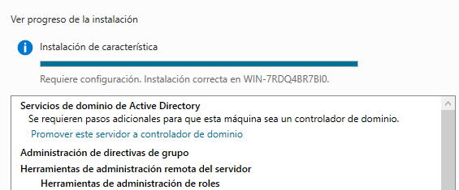

També activare el servei DNS i el servei Active Directory.

Jo també he fet funcional el servidor com a domini per tant li he assignat un nom de domini.

Li assigno una contrasenya.

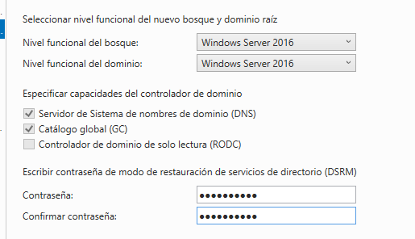

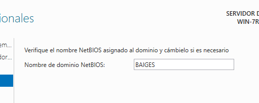

Un cop revisades les comprobacions ja estara instal·lat.

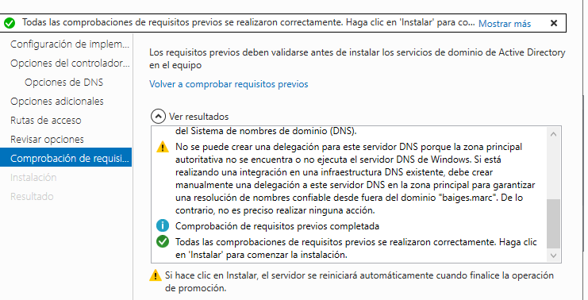

### - Unió d'equips

Per fer proves he creat un nou usuari dins herramientas del servidor i usuarios equipos de Active Directory.

Creo l'usuari Joan al servidor.

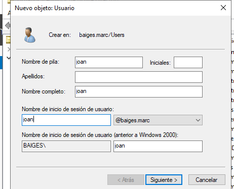

I una contrasenya.

A continuació entrare en un client desde un altra màquina al domini.

Comprovo que puc fer ping.

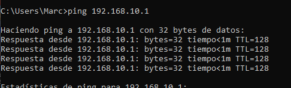

Ara uneixo el client al servidor. 

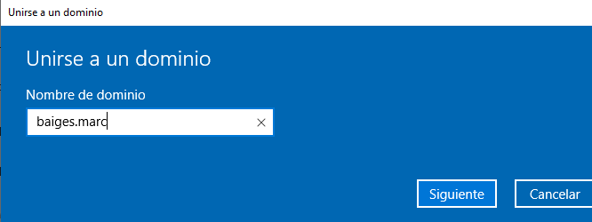

M'unire al usuari creat joan.

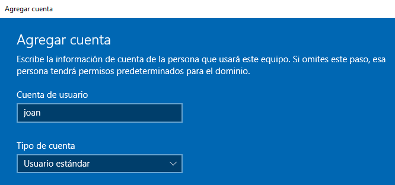

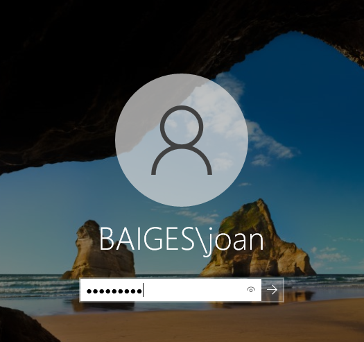

I ja estare dins del domini amb l'usuari.

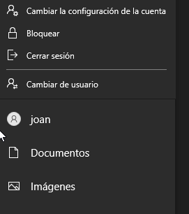

### - Creació de grups

Podem crear grups per gestionar els usuaris de manera més eficaç. El procés per crear grups és molt similar al de crear usuaris.

A continuació creo un grup de prova anomenat jugadors

Ara he afegit l'usuari Joan al grup jugadors.

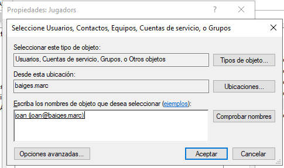

### - Unitats Organitzatives (UO) i GPOs

Les unitats organitzatives (UO) ens permeten organitzar els objectes de domini (com usuaris i equips) per aplicar polítiques de manera més eficient.

- Crearem una nova UO amb el botó dret sobre el domini i afegirem usuaris per provar les configuracions.

He afegit l'usuari a l'únitat organitzativa

#### - GPOs

Les polítiques de grup (GPO) permeten establir configuracions per a usuaris i equips dins del domini.

- Crearem una GPO per la UO i vincularem una política que mostri un missatge de benvinguda als usuaris quan iniciïn sessió.

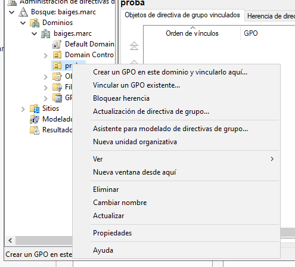

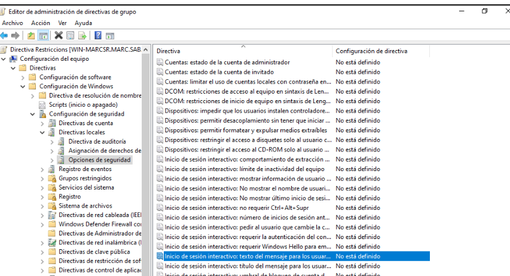

- A continuació, aplicarem restriccions com la prohibició d'accés al bluetooth.

- Realitzarem proves amb els usuaris per verificar que les restriccions funcionen correctament.

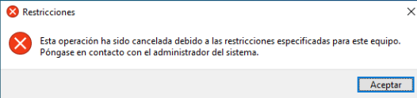

També podem establir polítiques de contrasenya a través de GPO, com la durada o complexitat de les contrasenyes.

### - Perfils mòbils

Els perfils mòbils permeten que els usuaris accedeixin a les seves dades des de qualsevol client del domini, guardant la informació en el servidor.

- Primer he creat una carpeta per perfils mobils.

- Ara compartixo la carpeta amb els usuaris del grup jugadors.

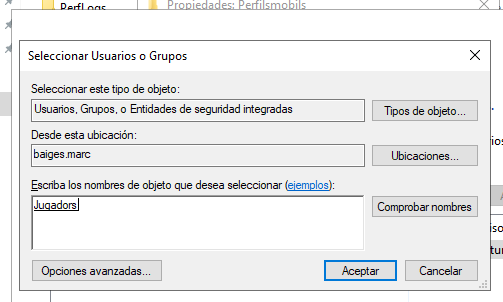

- En quant a permisos he assignat lectura i escriptura

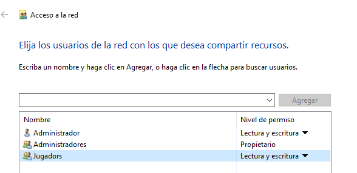

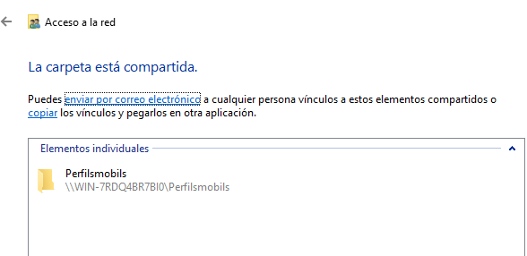

Un cop fet això he compartit la carpeta al usuari joan.

I ara si accedeixo al client ja podre accedir a la carpeta creada al servidor compartida als usuaris del grup jugadors, en aquest cas Joan si que pertany al grup.

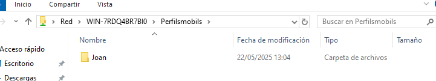
